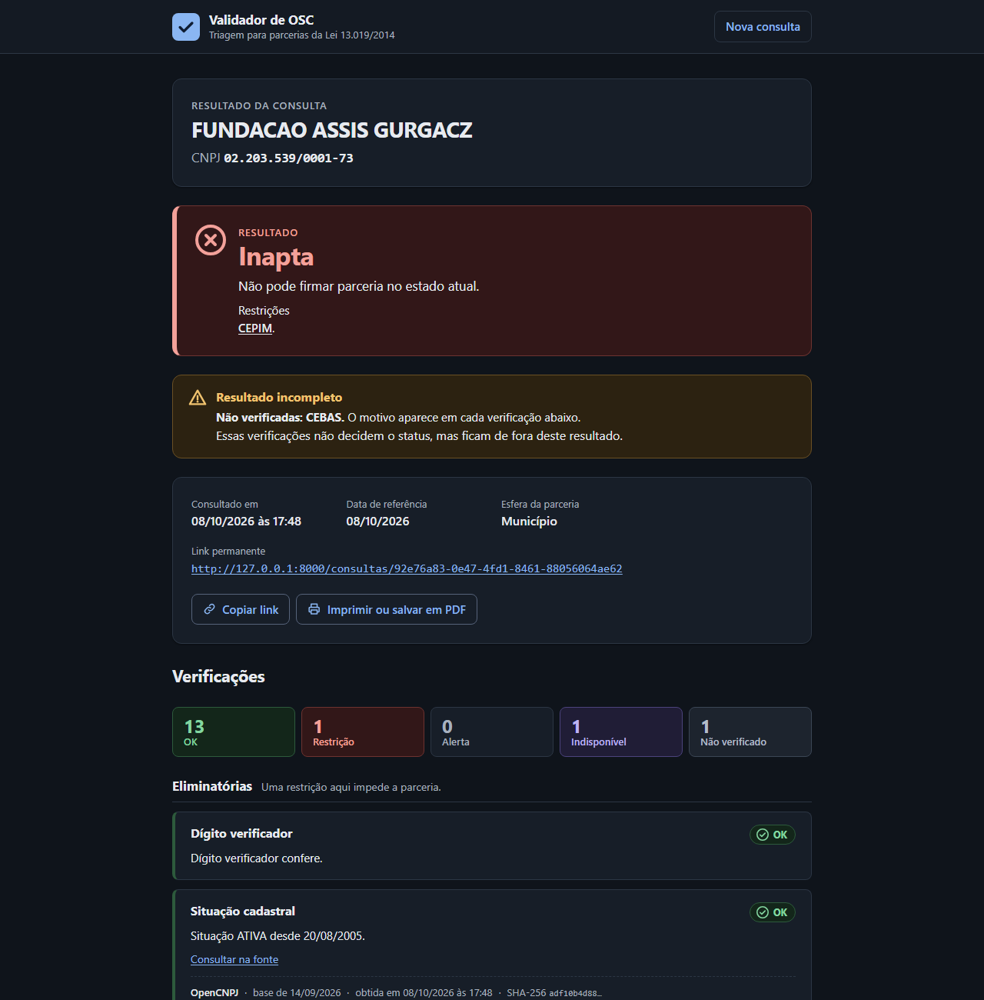
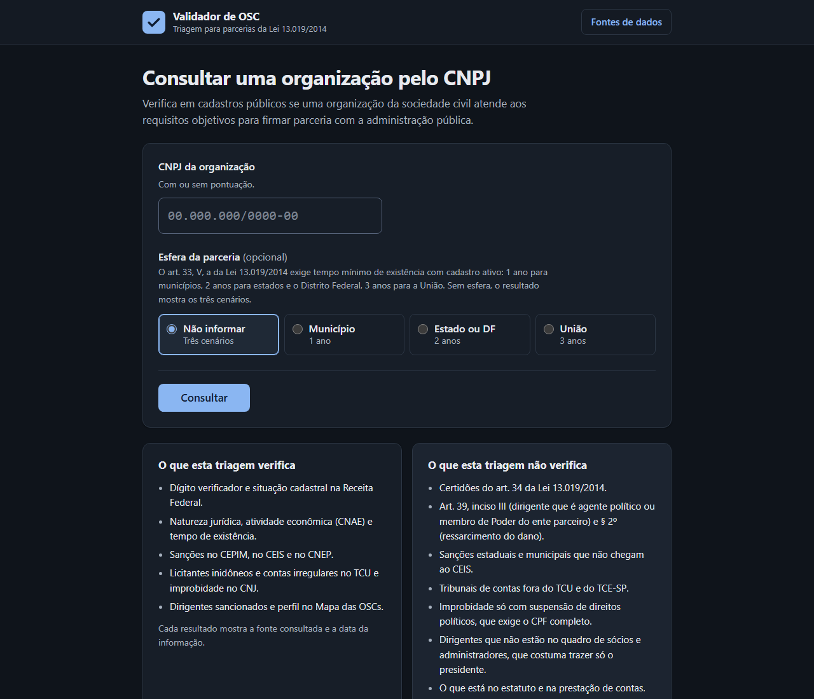
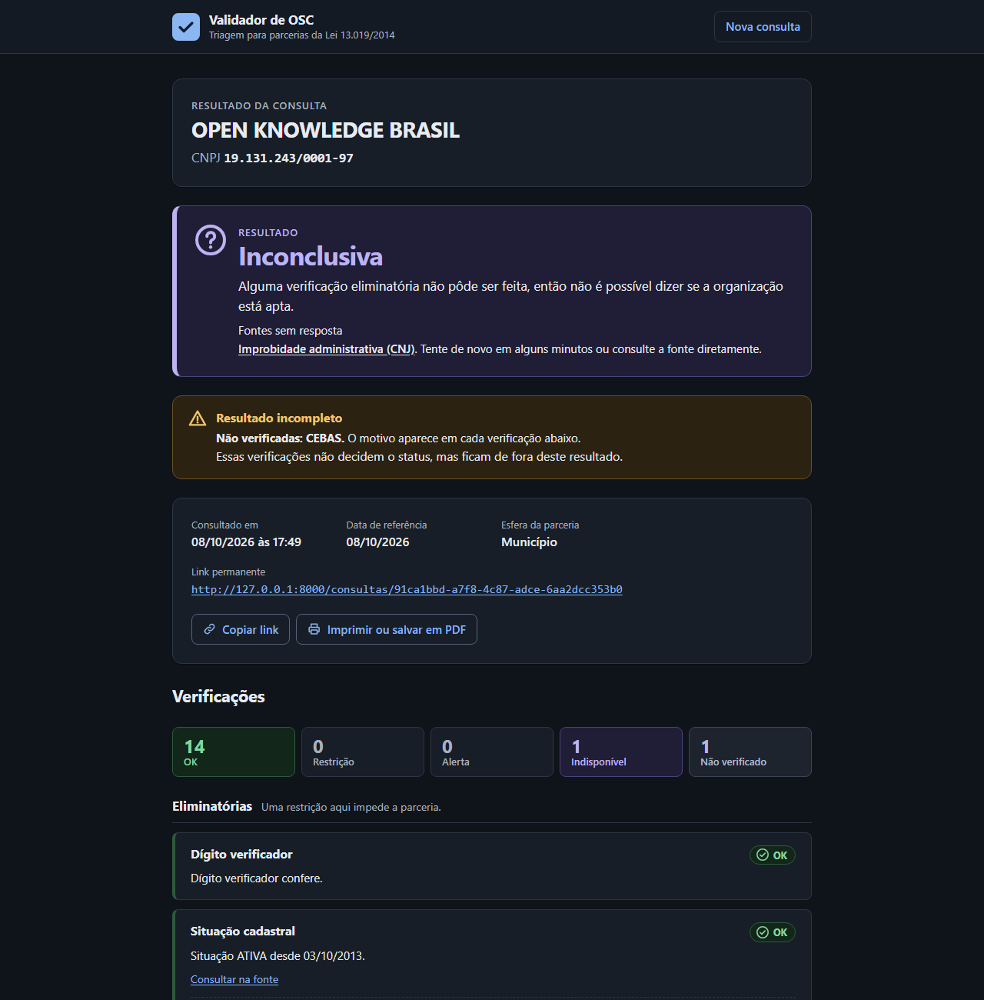
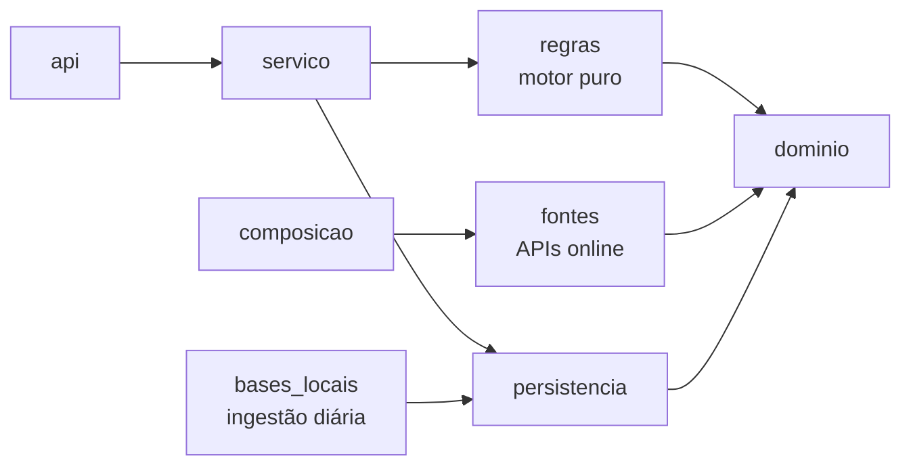
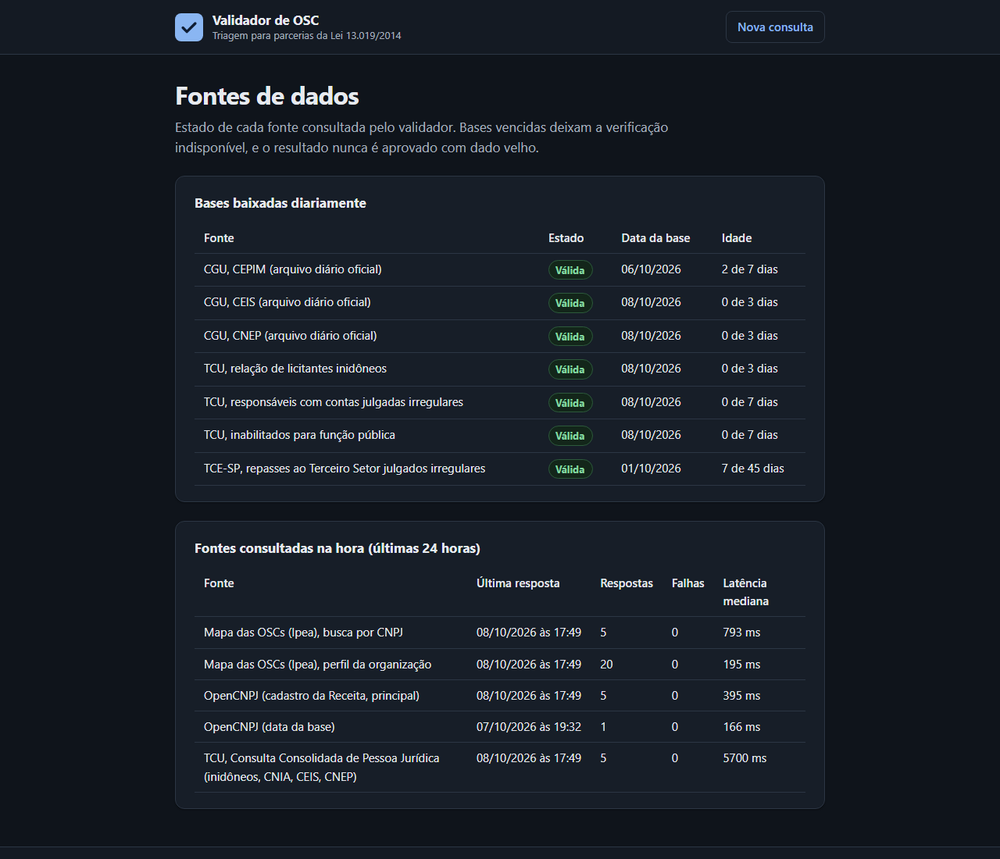

# Validador de OSC

[](https://github.com/ralphsblue/Radar-OSC/actions/workflows/ci.yml)


## Fala, dev!
Esse é o MVP de um projeto da faculdade (IFSP) que tem o objetivo de facilitar o processo para que CNPJ's se tornem OSC's.
De forma resumida, já que vamos abordar de forma mais detalhada ao longo desse arquivo, nós fazemos as verificações necessárias para que um CNPJ seja considerado uma osc,
 ja que atualmente esse processo é feito de forma manual, atrasando o tempo de análise. Buscamos os dados em API's publicas e base de dados públicas, e o processo está documentado.
Novamente, reforçando: esse ainda é apenas o MVP de um projeto de extensão. O foco no momento está na descoberta dos dados e em cruzar eles. Decisões arquiteturais complexas e análises extensivas de performance foram consideradas durante o desenvolvimento, mas não foi o comprometimento central.

---

Triagem automatizada de CNPJ para parcerias conforme o Marco Regulatório das Organizações da Sociedade Civil (Lei 13.019/2014).
O sistema consulta cadastros públicos e devolve um status (apta, apta com ressalvas, inconclusiva ou inapta), com a explicação de cada verificação e a fonte de cada dado.
É uma triagem: não substitui as certidões oficiais.

Projeto de extensão do IFSP.



## Por que existe

Para firmar parceria com a administração pública, a organização precisa ser uma OSC (art. 2º) e não pode estar impedida (art. 39).
Hoje essa checagem é feita à mão, em vários sites diferentes.
O validador faz a triagem em segundos, mostra de onde veio cada dado e nunca aprova quando uma fonte essencial não respondeu.

## O que é verificado

| Verificação | Fonte |
|---|---|
| Dígito verificador, situação cadastral, natureza jurídica, CNAE, organização religiosa, tempo de existência, filial e matriz | Receita Federal, via OpenCNPJ (reserva: BrasilAPI) |
| CEPIM, CEIS, CNEP | Arquivos diários oficiais da CGU, baixados para o banco |
| Licitantes inidôneos e improbidade (CNJ) | Consulta Consolidada do TCU e relação de inidôneos |
| Contas julgadas irregulares da própria OSC | TCU |
| Dirigentes do quadro de sócios | CEIS, CNEP, TCU (contas irregulares e inabilitados) e TCE-SP |
| Presença e perfil no Mapa das OSCs | Ipea |

O que a triagem não verifica (certidões do art. 34, sanções estaduais e municipais fora do CEIS, entre outros) aparece na própria página inicial.

<table>
  <tr>
    <td></td>
    <td></td>
  </tr>
  <tr>
    <td>Consulta por CNPJ, com a esfera da parceria.</td>
    <td>Se uma fonte eliminatória não responde, o resultado é inconclusivo, nunca apto.</td>
  </tr>
</table>

## Como funciona



- Os adaptadores só coletam fatos; o motor de regras, que não conhece HTTP nem banco, decide.
- A direção das dependências é conferida por máquina: 8 contratos do import-linter quebram o build se uma camada importar o que não deve.
- Toda resposta de fonte é guardada com hash SHA-256 e ligada à consulta, como evidência.
- Bases locais têm idade máxima; base vencida deixa a verificação indisponível.

Detalhes, diagramas e o caminho completo de uma consulta em [docs/arquitetura.md](docs/arquitetura.md).

## Tecnologia

Python 3.14, FastAPI, Jinja2, httpx, SQLAlchemy 2 (assíncrono), PostgreSQL 17, Alembic, structlog e pydantic.
Interface em HTML, CSS e JavaScript simples, sem framework, com tema claro e escuro e impressão.
Qualidade: uv, ruff, mypy estrito, import-linter, pre-commit e GitHub Actions.

## Como rodar

Pré-requisitos: [uv](https://docs.astral.sh/uv/) e Docker.

```
uv sync
docker compose up -d --wait db
uv run alembic upgrade head
uv run validador-osc atualizar-bases
uv run validador-osc servir
```

A aplicação fica em http://127.0.0.1:8000.
O banco local usa a porta 15432, fora das faixas que o Windows costuma reservar.
No Windows, não use `--recarregar` com o log redirecionado: o recarregamento automático trava nesse cenário.

## Bases locais

`validador-osc atualizar-bases` baixa as bases oficiais (CGU, TCU e TCE-SP), confere a integridade e troca a versão ativa de uma vez só.
Cada base tem idade máxima (em `validador_osc/dados/limites.json`); depois dela, a verificação fica indisponível e o resultado vira inconclusivo, nunca aprovado.
O estado de cada base aparece em http://127.0.0.1:8000/fontes.



Para agendar a atualização diária no Windows (executar uma vez, no PowerShell):

```
.\scripts\agendar_atualizacao.ps1 -Horario 06:00
```

Em Linux, use o cron com `uv run --no-sync validador-osc atualizar-bases`.

## Configuração

Variáveis com prefixo `VOSC_`, documentadas em `.env.example`.
`VOSC_TOKEN_OPERADOR` libera, no header `X-Token-Operador`, os nomes de dirigentes com possível correspondência e as evidências brutas em `/api/v1/evidencias/{id}`.
`VOSC_LIMITE_CONSULTAS_POR_MINUTO` limita consultas por endereço IP (0 desliga).

## API

Documentação interativa em http://127.0.0.1:8000/docs.

- `POST /api/v1/consultas` com `{"cnpj": "...", "esfera": "municipio|estado|uniao", "atualizar": false}`.
- `GET /api/v1/consultas/{id}`: resultado gravado (link permanente).
- `GET /api/v1/fontes`: estado das fontes online e das bases locais.

Erros seguem o formato `application/problem+json` (RFC 9457).

## Qualidade

```
uv run ruff check
uv run ruff format --check
uv run mypy
uv run lint-imports
uv run pytest
```

São mais de 1.200 testes: unidade, contrato com respostas reais gravadas, integração com PostgreSQL e ponta a ponta com as fontes em replay, sem rede.
Os testes de integração e de ponta a ponta usam o banco `validador_teste`, criado automaticamente.

## Documentação

| Documento | Conteúdo |
|---|---|
| [docs/arquitetura.md](docs/arquitetura.md) | Camadas, regras de dependência, fluxos e mapa das pastas |
| [docs/especificacao.md](docs/especificacao.md) | Especificação funcional do MVP |
| [docs/decisoes.md](docs/decisoes.md) | Decisões de produto e engenharia, com data e motivo |
| [docs/roteiro_demonstracao.md](docs/roteiro_demonstracao.md) | Roteiro de 10 minutos com CNPJs de exemplo |
| [docs/pesquisa/](docs/pesquisa/README.md) | Testes de cada fonte de dados antes do código |

## In English

Validador de OSC screens a Brazilian nonprofit's CNPJ (company registry number) against public registries to check whether it may sign partnerships with the government under Law 13.019/2014.
It cross-checks the federal company registry, federal sanction lists (CGU), the Federal Court of Accounts (TCU), the National Justice Council (CNJ), the São Paulo State Court of Accounts and the Ipea nonprofit map, and explains every check with its source and date.
The rules engine is pure and isolated from I/O, dependency direction between layers is enforced in CI with import-linter, every source response is stored with a SHA-256 hash as evidence, and a source that fails never turns into an approval.
Stack: Python 3.14, FastAPI, async SQLAlchemy, PostgreSQL, httpx, plain HTML/CSS/JS, with 1,200+ tests including contract tests on recorded real responses and network-free end-to-end tests.

## Licença

[MIT](LICENSE).
