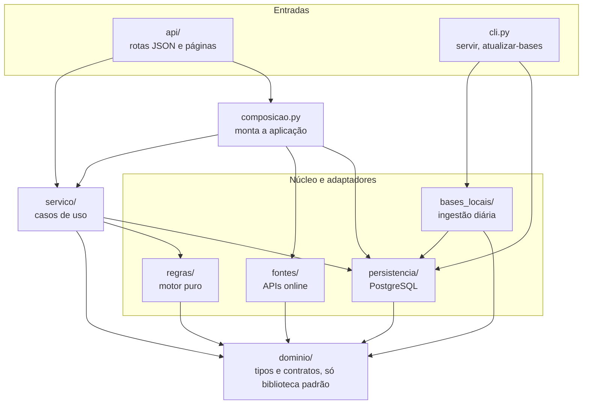
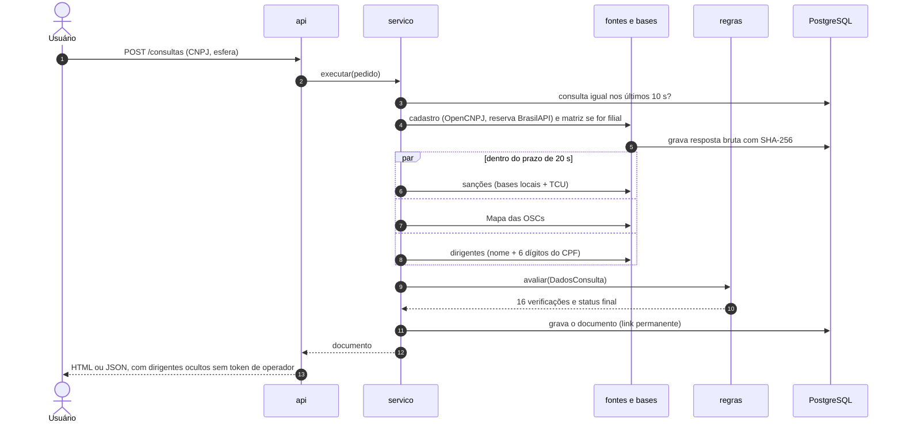
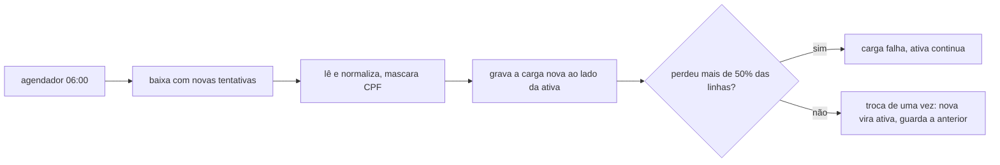

# Arquitetura

Este documento explica como o código está organizado, como as partes conversam e por quê.
O planejamento original, com todas as alternativas consideradas, está em `docs/historico/arquitetura_planejamento.md`.

## Ideia central

O validador separa quem coleta dados de quem decide.
Os adaptadores (`fontes/` e `bases_locais/`) só devolvem fatos: obtido, não encontrado ou falha.
O motor de regras (`regras/`) recebe esses fatos e decide o estado de cada verificação e o status final.
O motor não faz HTTP, não abre banco e não conhece a web, por isso é testado com dados fabricados em milissegundos.
Uma fonte que não respondeu nunca vira aprovação: o motor marca a verificação como indisponível e o resultado como inconclusivo.

## Camadas



Todas as setas apontam para baixo: nenhuma camada importa uma camada acima dela.

| Pacote | Papel | Depende de |
|---|---|---|
| `dominio/` | Vocabulário comum: `Cadastro`, `Sancao`, `Coleta` (`Obtido`, `NaoEncontrado`, `Falha`), `Estado`, `Avaliacao`, CNPJ, CPF parcial e a porta `Evidencias` | Só a biblioteca padrão |
| `regras/` | Motor puro: 16 verificações, agregação do status final e parâmetros do orientador em JSON | `dominio` |
| `fontes/` | Clientes HTTP das fontes online (OpenCNPJ, BrasilAPI, TCU, Mapa das OSCs) e normalização das respostas | `dominio`, httpx, pydantic |
| `bases_locais/` | Download, leitura e carga diária das bases oficiais (CGU, listas do TCU, TCE-SP) | `dominio`, `persistencia` |
| `persistencia/` | Tabelas, repositórios e sessões do PostgreSQL | `dominio`, SQLAlchemy |
| `servico/` | Casos de uso: consultar um CNPJ, coletar em paralelo, montar o documento, estado das fontes | `dominio`, `regras`, `persistencia` |
| `composicao.py` | Raiz de composição: o único módulo que cria as implementações concretas e as entrega ao serviço | Todos os anteriores |
| `api/` | FastAPI, páginas Jinja, privacidade dos dirigentes e limite de uso | `servico`, `composicao` |
| `cli.py` | Linha de comando: `servir`, `atualizar-bases`, `ingerir` | `bases_locais`, `persistencia` |

## Regras de dependência verificadas por máquina

As regras acima não dependem de disciplina: o import-linter as confere no pre-commit e no CI, e um import proibido quebra o build.
Os contratos estão em `pyproject.toml`.

| Contrato | O que impede |
|---|---|
| Domínio só depende da biblioteca padrão | Tipos do domínio puxando banco, HTTP ou regras |
| Motor de regras é puro | `regras/` importar httpx, SQLAlchemy, FastAPI ou qualquer adaptador |
| Fontes não conhecem regras, banco nem API | Adaptador online decidindo ou gravando direto no banco |
| Bases locais não conhecem regras nem API | Ingestão decidindo estado de verificação |
| Persistência não conhece regras, fontes nem API | Repositório com lógica de negócio |
| Serviço não conhece a API nem os adaptadores concretos | Caso de uso preso a FastAPI ou a um cliente HTTP específico |
| Serviço usa o motor de regras só pela fachada | Serviço importando módulos internos de `regras/` |
| API só fala com o serviço | Rota acessando banco, fontes ou regras diretamente |

## Dependência invertida nas bordas

O serviço e os adaptadores conversam por interfaces (`Protocol`), e só `composicao.py` conhece as classes concretas.

- `dominio/evidencias.py` define `Evidencias`; `persistencia` implementa; `fontes` usa para cache e para guardar cada resposta bruta.
- `servico/` define `FonteCadastral`, `FonteMapa`, `FonteCertidoesTcu`, `BasesLocais` e `BasesPessoasFisicas`; `fontes` e `persistencia` implementam.

Por isso os testes trocam o banco por memória e as fontes externas por respostas gravadas, sem mudar o código de produção.
O relógio e o transporte HTTP também são injetados em `criar_app`, o que deixa os testes de ponta a ponta determinísticos.

## Caminho de uma consulta



Arquivos: `servico/consulta.py` (orquestração), `regras/motor.py` (decisão), `servico/documento.py` (documento gravado), `api/privacidade.py` (ocultação dos dirigentes).

## Bases baixadas diariamente

CEIS, CNEP e CEPIM (CGU), três listas do TCU e a planilha do TCE-SP não têm API adequada.
Elas são baixadas uma vez por dia por `validador-osc atualizar-bases` e consultadas localmente.



Cada base tem idade máxima em `validador_osc/dados/limites.json` (CEIS e CNEP: 3 dias).
Base vencida deixa a verificação indisponível, e o resultado nunca é aprovado com dado velho.
O ciclo genérico está em `bases_locais/carga.py`; cada formato tem seu módulo (`sancoes_cgu.py`, `listas_tcu.py`, `tcesp.py`).

## Mapa das pastas

```
validador_osc/
├── dominio/          tipos imutáveis, CNPJ, CPF parcial, porta de evidências
├── regras/
│   ├── __init__.py   fachada pública: avaliar, DadosConsulta, entradas, tabelas
│   ├── motor.py      chama as 16 verificações e agrega o status
│   ├── entradas.py   o que o motor recebe
│   ├── comum.py      utilitários das verificações
│   ├── tabelas/      CNAE e natureza jurídica (JSON em dados/)
│   └── verificacoes/ uma regra por módulo
├── fontes/           clientes HTTP e normalização por fonte
├── bases_locais/     ingestão diária com troca atômica
├── persistencia/     modelos e repositórios
├── servico/          casos de uso
├── api/              rotas, templates e estáticos
├── composicao.py     raiz de composição
├── cli.py            linha de comando
├── config.py         variáveis VOSC_*
└── dados/            tabelas e parâmetros do orientador
tests/
├── unit/             regras, normalização, serviço, páginas
├── contrato/         respostas reais gravadas byte a byte
├── integracao/       banco de teste isolado
├── e2e/              aplicação inteira com fontes em replay, sem rede
├── apoio/            fábricas e geradores compartilhados
└── fixtures/
migrations/           Alembic
docs/                 especificação, decisões, arquitetura, pesquisa
```

## Testes

| Camada | O que garante |
|---|---|
| Unidade | Cada verificação, a agregação, a normalização e o serviço com dublês |
| Contrato | A normalização continua entendendo respostas reais das fontes, gravadas byte a byte |
| Integração | Repositórios, migrações e ingestão contra PostgreSQL, em um banco de teste separado |
| Ponta a ponta | A aplicação inteira, com as fontes externas servidas por replay, contra os casos de referência da pesquisa |

## Decisões

As decisões de produto e de engenharia, com data e motivo, estão em `docs/decisoes.md`.
A especificação funcional está em `docs/especificacao.md`.
